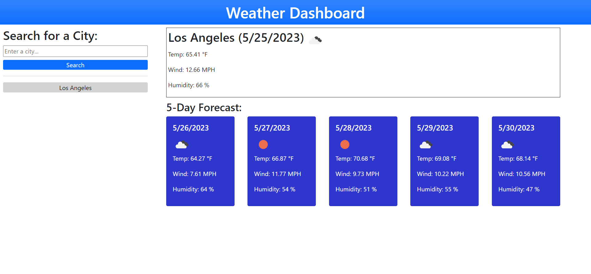

# weather-dashboard

## Description

The Weather Dashboard project allows the user (or traveler) to view current and future weather conditions for any US city. It was built using the core front end languages (HTML, CSS, and JavaScript) along with a few third party APIs (Bootstrap and Dayjs library) and the OpenWeather server side API. 

[Weather Dashboard](https://codehashira28.github.io/weather-dashboard/)

## Installation

N/A

## Usage

The Weather Dashboard features a simple user interface that allows the user to enter a city into a text field and click the "Search" button. Once submitted, the application will return information for the current weather and the next five-days forecast by showing the date, an icon representing the weather conditions, temperature, wind speed, and humidity. When the user searches a city, it will be added to the search history section. This will allow the user to click on any city in the search history and the weather information for that city will be re-displayed.

## Credits

Design inspired by mockup
